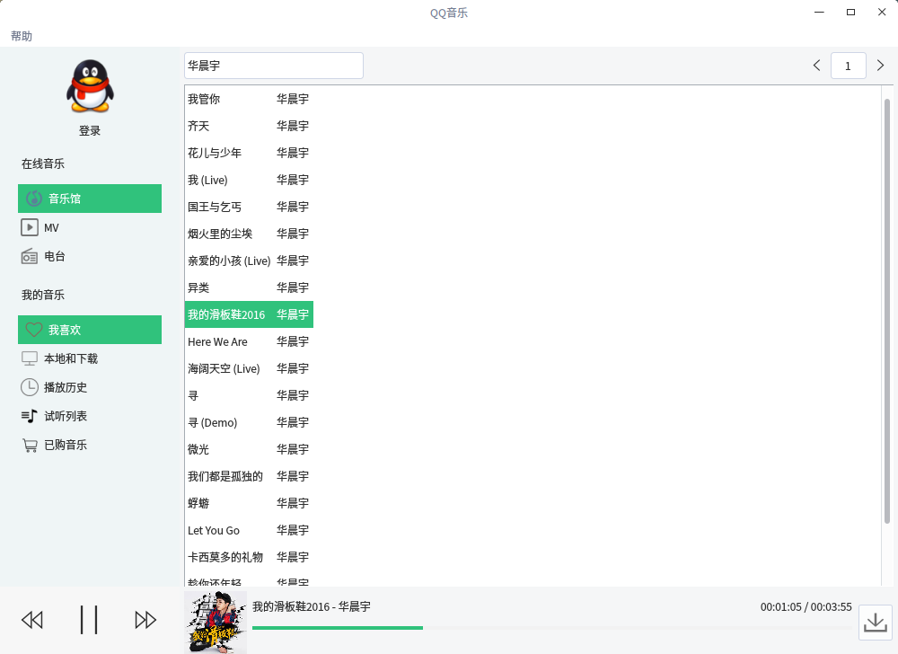
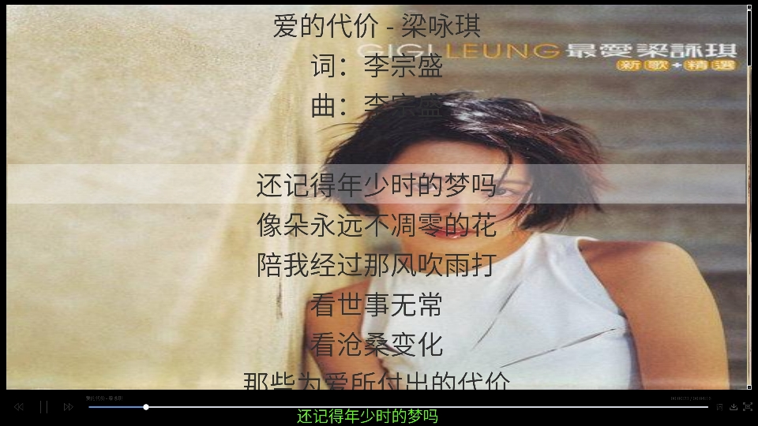

# Qt: QQMusic
  
一款基于 Qt 5.10.1 的QQ音乐播放器，拟补QQ音乐没有Linux客户端的不足，音乐版权归腾讯所有。  
左侧的列表没有功能，千万别当真。
### 参考
UI：QQ音乐  
API：  
[https://github.com/deepins/qq-music-api](https://github.com/deepins/qq-music-api)  
https://www.cnblogs.com/SoraAoi/p/3311771.html

### V2.3
* 歌曲播放新API
### V2.2
* 增加全屏模式。
  
### V2.1
* 增加修改桌面歌词颜色和字体。
* 保存歌词颜色、字体、位置和歌曲下载路径。
* 点击单元格复制单元格内容。
* 歌词高亮
### V2.0
* 增加歌词、桌面歌词  
### V1.0
* 搜索歌曲播放